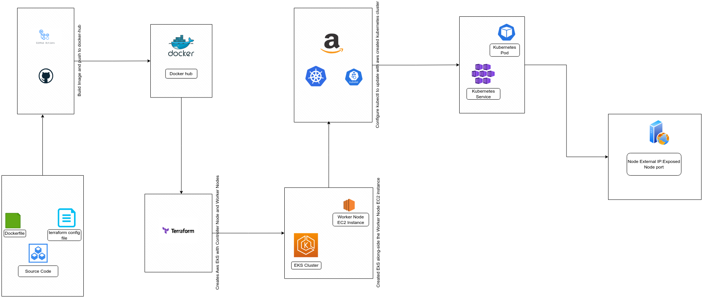

<h1>Ecomern Project</h1>



<p>This repository contains the necessary files and configurations to deploy this application using Amazon Elastic Kubernetes Service (EKS). The project includes a Dockerfile to containerize the application and push it to Docker Hub, Terraform configurations to provision the AWS EKS cluster and EC2 nodes, Kubernetes configuration for interacting with the EKS cluster, and deployment and service manifest YAML files for deploying the application. You can also access the web application via the exposed node port.</p>

 &nbsp; <h4>Dockerization and Docker Hub</h4>

1. Clone this repository to your local machine:
```bash
git clone https://github.com/ufas-001/ecomerce-cloud-client-service.git

cd your-repo
```

2. Build a Docker image of your application using the provided Dockerfile:
```bash
docker build -t your-image-name:your-tag .
```

3. Log in to Docker Hub:
```bash
docker login
```

4. Push the Docker image to Docker Hub:
```bash
docker push yourusername/your-image-name:your-tag
```


&nbsp; <h4>AWS EKS Cluster Provisioning</h4>

1. Navigate to the terraform directory:
```bash
cd terraform
```

2. Initialize Terraform:
```bash
terraform init
```
3. Apply the Terraform configuration to provision the AWS EKS cluster and EC2 nodes:
```bash
terraform apply
```

&nbsp; <h4>Configuring kubectl</h4>

1. Configure kubectl to use the newly created EKS cluster:
```bash
aws eks --region <your-region> update-kubeconfig --name <your-cluster-name>
```

&nbsp; <h4>Deploying the Application</h4>
1. Navigate to the Kubernetes directory:
```bash
cd kubernetes
```
2. Deploy the application using the provided manifest files:
```bash
kubectl apply -f deployment.yaml
kubectl apply -f service.yaml
```

&nbsp; <h4>Accessing the Application</h4>

1. Get the external IP of the EKS node:
```bash
kubectl get nodes -o wide
```

2. Access the web application using the exposed node port. Open a web browser and enter 
```bash
http://<node-external-ip>:<node-port>
```
Replace <node-external-ip> and <node-port> with the values obtained from the previous s